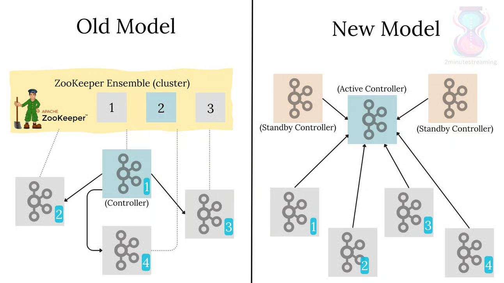

# Handover Kafka 4.0 Version

## 外部連結

[Apache Kafka 4.0 Document](https://kafka.apache.org/documentation/)
[GitHub Repo of Handover_Kafka](https://github.com/HuangFish799/Handover_Kafka)

---

## 目錄

1. [簡介](#簡介)
2. [單一節點單 Broker](#單一節點單-broker)
3. [單一節點多 Broker](#單一節點多-broker)
4. [多節點多 Broker](#多節點多-broker)

---

## 簡介

Apache Kafka 是一個分散式的串流平台，主要功能包括：

- 發布與訂閱記錄流
- 儲存記錄流
- 處理記錄流

### Kafka 4.0 主要功能改動

- 改進效能與壓縮效率
- 增強集群容錯與快照功能
- Kafka Raft Metadata Mode 改為預設（移除了 ZooKeeper）
- 支援 Tiered Storage（可將歷史資料外部化）
- 安全性與觀察性提升


### Partitions（分區）

- Kafka 的每個 Topic 可以被切成多個 **partition**。
- 每個 partition 是一個 **有序、不可變的訊息序列**，並會持久化到磁碟。
- 多個 partition 可以提升 **並行處理效能**，讓 Producer 與 Consumer 可以同時處理不同分區內的資料。
- 每個 partition 只能由一個 broker 主控（leader），但可以有其他 broker 備援（follower）。

例如：

```bash
--partitions 3
```

表示這個 topic 有 3 個分區。

### Replication Factor（副本數）

- 為了 **容錯與高可用性**，Kafka 允許對 partition 做資料複製。
- 每個 partition 可以有一個主副本（leader）與多個追隨副本（follower）。
- 當 broker 故障時，Kafka 會選擇 follower 成為新的 leader，確保不中斷服務。

例如：

```bash
--replication-factor 2
```

表示每個 partition 將會在兩個 broker 上有副本。

- `replication-factor` **不能大於 broker 數量**。
- 在單一節點單 broker 的情境下，`--replication-factor` 最大只能設為 1。

### 實務建議設定

| 情境                         | partitions | replication-factor |
|----------------------------|------------|--------------------|
| 單機測試                     | 1          | 1                  |
| 單節點多 broker 模擬測試       | 3          | 2                  |
| 正式環境（3+ 節點）           | 6 或以上   | 至少 3             |
---

## 單一節點單 Broker

這是最簡單的 Kafka 架構，適合開發與測試用途。

### 環境需求

- 作業系統：Linux / macOS / WSL2
- Java 17+
- Kafka 4.0 套件

### 安裝步驟

1. **下載 Kafka 4.0**

```bash
wget https://downloads.apache.org/kafka/4.0.0/kafka_2.13-4.0.0.tgz
tar -xzf kafka_2.13-4.0.0.tgz
cd kafka_2.13-4.0.0
```

2. **啟動 Kafka（使用 KRaft 模式）**

產生叢集 uuid：

```bash
KAFKA_CLUSTER_ID="$(bin/kafka-storage.sh random-uuid)"
```

初始化 metadata：

```bash
bin/kafka-storage.sh format --standalone -t $KAFKA_CLUSTER_ID -c config/server.properties
```

啟動 broker：

```bash
bin/kafka-server-start.sh config/server.properties
```

3. **測試建立 Topic**

```bash
bin/kafka-topics.sh --create --topic test-topic --bootstrap-server localhost:9092 --partitions 1 --replication-factor 1
```

4. **測試 Producer 與 Consumer**

```bash
# Producer
bin/kafka-console-producer.sh --topic test-topic --bootstrap-server localhost:9092

# Consumer
bin/kafka-console-consumer.sh --topic test-topic --from-beginning --bootstrap-server localhost:9092
```

---

## 單一節點多 Broker

適合模擬集群行為，不需多台主機。

### 設定多個 Broker

1. **複製多份配置檔**

```bash
cp config/server.properties config/server-1.properties
cp config/server.properties config/server-2.properties
```

2. **修改每份設定**

設定 `node.id`, `controller.quorum.voters`, `log.dirs`, `listeners`, `controller.listener.names`：

`server-1.properties`

```properties
node.id=1
process.roles=broker,controller
controller.quorum.voters=1@localhost:9093,2@localhost:9095
controller.listener.names=CONTROLLER
listeners=PLAINTEXT://localhost:9092,CONTROLLER://localhost:9093
log.dirs=/tmp/kafka-logs-1
```

`server-2.properties`

```properties
node.id=2
process.roles=broker,controller
controller.quorum.voters=1@localhost:9093,2@localhost:9095
controller.listener.names=CONTROLLER
listeners=PLAINTEXT://localhost:9094,CONTROLLER://localhost:9095
log.dirs=/tmp/kafka-logs-2
```

3. **初始化每個 Broker 的資料儲存**

```bash
bin/kafka-storage.sh format -t "$KAFKA_CLUSTER_ID" -c config/server-1.properties
bin/kafka-storage.sh format -t "$KAFKA_CLUSTER_ID" -c config/server-2.properties
```

4. **分別啟動兩個 Broker**

```bash
bin/kafka-server-start.sh config/server-1.properties
bin/kafka-server-start.sh config/server-2.properties
```

---

## 多節點多 Broker

用於正式部署、具備高可用性與水平擴展能力。

### 環境需求

- 至少 3 台伺服器（建議為偶數 + 1）
- 每台機器安裝 Java、Kafka 4.0

### 架構說明

- 每個節點有獨立 `broker.id` 或 `node.id`
- 所有節點互相能通訊
- 使用 Kafka Raft 協議維持 metadata 一致性

### 範例：三台機器節點配置

假設有三台主機：

| 節點 | IP             | Node ID | Broker Port | Controller Port |
|------|----------------|---------|-------------|-----------------|
| A    | 192.168.1.101  | 1       | 9092        | 9093            |
| B    | 192.168.1.102  | 2       | 9094        | 9095            |
| C    | 192.168.1.103  | 3       | 9096        | 9097            |

在每台機器上設定 `server.properties`：

```properties
process.roles=broker,controller
node.id=1  # (各台機器不同)
controller.listener.names=CONTROLLER
listeners=PLAINTEXT://0.0.0.0:9092,CONTROLLER://0.0.0.0:9093
advertised.listeners=PLAINTEXT://192.168.1.101:9092
controller.quorum.voters=1@192.168.1.101:9093,2@192.168.1.102:9095,3@192.168.1.103:9097
log.dirs=/data/kafka-logs
```

### 啟動流程

1. 格式化儲存：

```bash
bin/kafka-storage.sh format -t "$KAFKA_CLUSTER_ID" -c config/server.properties
```

2. 啟動每台機器的 Kafka Server：

```bash
bin/kafka-server-start.sh config/server.properties
```

### 驗證集群狀態

在任一台節點執行：

```bash
bin/kafka-metadata-shell.sh --snapshot /data/kafka-logs/__cluster_metadata-*/latest/snapshot
```